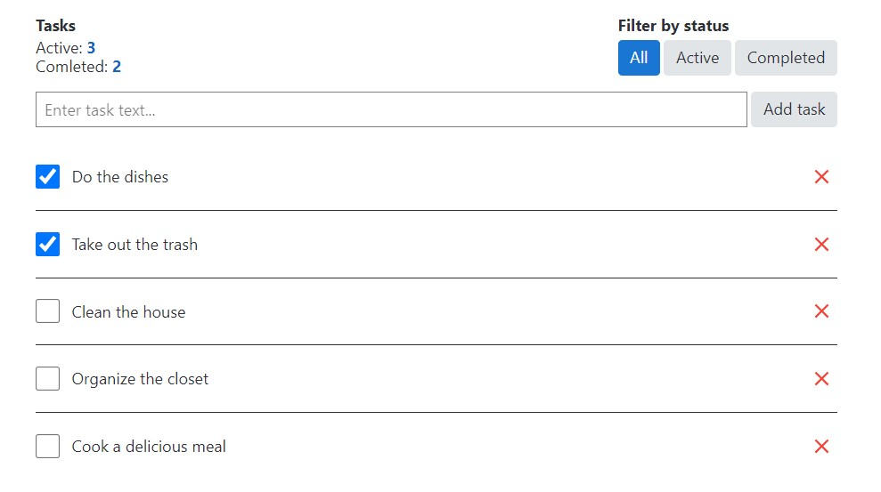

<h1 align="center"> ToDo List App </h1>

This is a simple ToDo List application built with React and Redux. It allows you to manage your tasks, mark them as completed, and delete them.

## Features

- Add a new task
- Mark tasks as completed
- Delete tasks
- Filter tasks based on their completion status

## Technologies

- **React:** A JavaScript library for building user interfaces.
- **Redux:** A predictable state container for JavaScript applications.
- **Formik:** A popular form library for React applications.
- **Yup:** A JavaScript schema builder for value parsing and validation.
- **GitHub Actions:** Automate your workflow using GitHub Actions.